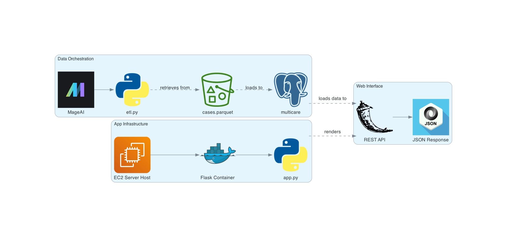

# MultiCare Data ETL and Flask API Project

[Live Project UR](http://18.224.31.100:8080/)

## Project Description

This project provides an end-to-end solution for extracting, transforming, and loading (ETL) data from the MultiCare dataset, which contains information about medical cases described in PubMed Central. The data, housed in an AWS S3 bucket in the form of a `cases.parquet` file, is processed and loaded into a PostgreSQL database called `multicare`. Furthermore, the project includes a Flask REST API, deployed using Docker on AWS EC2, for easy and efficient retrieval of this data.

### ETL Process

The ETL process involves the following steps orchestrated via an open-source solution known as `MageAI`:
1. **Extraction:** Data is extracted from the `cases.parquet` file located in the AWS S3 bucket.
2. **Transformation:** The extracted data is cleaned and transformed into a format suitable for analysis.
3. **Loading:** The transformed data is loaded into the `multicare` table within a PostgreSQL database.

### Flask REST API

The Flask REST API provides two primary functions:
1. **Retrieval of Metadata:** Allows users to fetch metadata related to medical cases without the actual medical text returned within `cases.parquet` file.
2. **Retrieval of Medical Text Data:** Enables users to specifically retrieve the medical text from the `cases.parquet` file.

Data is returned in JSON format to facilitate ease of use and integration with other applications / needs.

### Deployment

The Flask application is containerized using Docker and deployed on an AWS EC2 instance, ensuring scalability and ease of maintenance.

## Architecture Diagram

Below is the architecture diagram of the project, showcasing the complete workflow from data extraction to API usage:

## Getting Started

To use the API, follow these steps:
1. Access the live API at [Live Project URL](http://18.224.31.100:8080/).
2. Make a request to the desired endpoint:
    - For metadata: `/case_metadata`
    - For medical text: `/case_text`
    - Query Parameters:
        - `n` : Number of results to retrieve

3. The data will be returned in JSON format.

## Future Steps

1. Adding information extraction capabilities from medical text using `Langchain`.

2. Knowledge graph querying of medical concepts within PMC via `Neo4J`.
